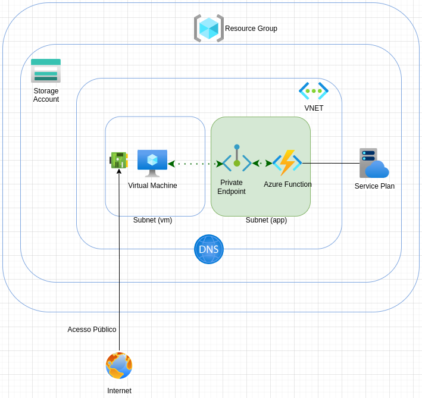

# private-azure-function

Criação de uma azure function privada usando código terraform

## Motivação
Atuo há 5 anos com [AWS](https://aws.amazon.com/pt/), mas recentemente comecei minhas aventuras na [Azure](https://azure.microsoft.com/pt-br/). Tive algumas dificuldades na implementação de alguns serviços por um erro que imagino ser comum, a comparação na implementação com outros cloud providers. Após inúmeras dificuldades conceituais, cheguei no código para implementar uma azure function privada, e minha motivação é compartilhar para ajudar outros profissionais.

## Atenção
Exceto se você ainda estiver com uma conta gratuito da Azure, seguir com a implementação da azure function proposta nesse repo vai lhe custar dinheiro, alguns dos recursos provisionados serão cobrados (ex: VM, private endpoint)


## Pré-Requisitos
#### [Linux]
#### [Terraform](https://developer.hashicorp.com/terraform/install)

#### [Conta na Azure]

## Configuração e Provisionamento

O código criará uma VM, vamos acessá-la via SSH, para isso é necessário gerar as chaves usando o comando à seguir:
```bash
ssh-keygen
```
Siga as instruções, basicamente indicar o nome do arquivo das chaves publica (.pub) e privada:
```
$ ssh-keygen 
Generating public/private rsa key pair.
Enter file in which to save the key (...): private-azure-function
Enter passphrase (empty for no passphrase): 
Enter same passphrase again: 
Your identification has been saved in private-azure-function
Your public key has been saved in private-azure-function.pub
The key fingerprint is:
SHA256:PCFFOribHjE9OEUqQYBEsVGfqAoZYPGMFVgqs7NCTaw brunosantosnet@latitude
The key's randomart image is:
+---[RSA 3072]----+
|*XO=. ..o        |
|+.X.o+.o         |
|++.*oo= .        |
|.==. = + .       |
|=E .* o S        |
|+o   * . .       |
|+   +            |
|.  . .           |
|    .            |
+----[SHA256]-----+
```

Realize o login na azure:
```bash
$ az login
```

Execute os comandos para inicializar o backend e baixar os `plugins` do `terraform`, assim como o comando para aplicar o código:
```bash
$ terraform init
```
```bash
$ terraform apply
```
Após concluir o `apply`, você terá criado na sua assinatura da Azure algo semelhante ao desenho:
<div align="center">

</div>
